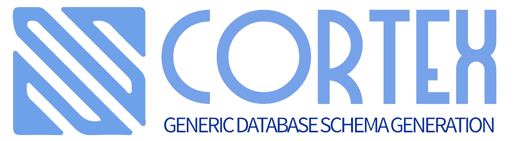

# cortex (WORK IN PROGRESS not useable yet) 🧠🗄️

Easily create database schemas with a unified API for any supported database. Introducing `cortex`, a Rust library designed to simplify and unify database schema creation across multiple database platforms.

 

## Why cortex?

- **Unified API**: No need to learn different schema creation languages or tools for different databases.
- **Flexibility**: Easily switch between databases or support multiple databases in a single product.
- **Extensibility**: If a database isn't already supported, extend the library by implementing the required traits.
- **Product Evolution**: As your product grows and scales, your database needs might change. Whether you're migrating, supporting multiple deployments, or optimizing for specific use-cases, `cortex` makes it a breeze.

## Features 🚀

- **Supported Databases**: PostgreSQL, SQLite(TODO), MySQL(TODO), and more. Easily expand to others.
- **Schema Creation**: Define once, use anywhere. No more database-specific scripts.
- **Validation**: Validate schemas against the selected database before application.

## Getting Started 🛠️

### Installation

Add `cortex` to your `Cargo.toml`:

```toml
[dependencies]
cortex = { git = "https://github.com/danielnehrig/cortex" }
```

### Basic Usage

Define and create a schema:

```rust
use cortex::{
    connection::{postgres::Postgres, ConnectionConfig},
    objects::{
        database::Database,
        statement::{Statement, DbAction},
        step::{Step, StepType},
        table::{PropType, Table, TableProp},
    },
    CortexPostgres,
};

let users = Table::new("users").add_prop(("id", PropType::Int, None));
let orders = Table::new("orders").add_prop(("id", PropType::Int, None));
let db = Database::new("test");
let data = Step::new("Init Schema", StepType::Update, semver::Version::new(0, 0, 1))
    .add_statement(Statement::Database(&db, DbAction::Create))
    .add_statement(Statement::Table(&users, DbAction::Create))
    .add_statement(Statement::Table(&orders, DbAction::Create))
    .add_statement(Statement::Table(&users, DbAction::Drop));
let client_conf = ConnectionConfig::<Postgres>::default();
let connection = Postgres::new(client_conf).expect("to connect to db");
let producer = CortexPostgres::new(connection).add_step(data);
```

## Extend `cortex` to Other Databases 🌍

Implement:
- `CortexSomeDb` struct
- `SomeDbStatementProducer` struct
- `Connection` struct

see `cortex`, `producer` and `connection` folder for examples.


## Use Cases 💼

- **Product Scalability**: Whether starting with SQLite for MVP or scaling up with PostgreSQL for production, `cortex` adapts with your needs.
- **Multi-tenant Systems**: Support multiple databases for different clients or deployments with a unified schema interface.
- **Rapid Development**: Prototype and switch databases without rewriting schema creation logic. Perfect for startups and agile development!

## Contribution 🤝

Got ideas or improvements?

- Open an issue for bugs, enhancements, or feature requests.
- Fork, improve, and submit a pull request.

---

## Roadmap 🛣️

At `cortex`, we're always looking to expand our capabilities and make schema management more powerful and seamless. Here's a glimpse of what's coming:

### Upcoming Database Support 📊

- **SQLite**: As one of the most used Embedded databases it's our goal as early as possible to ensure we support it.
- **MongoDB**: As a leading NoSQL database, adding MongoDB support is high on our list. Stay tuned for more updates.
- **Postgres**: Known for its robustness, we're actively working on integrating Postgres to extend `cortex`'s reach to more enterprise applications.

### Feature Enhancements ⚙️

- **Database Versioning**: A highly requested feature, we aim to provide tools that allow developers to version their databases. This ensures backward compatibility and smoother migrations, especially in large-scale deployments.
  
- **Schema Versioning**: Beyond the database, managing individual schema versions is essential for rapidly evolving applications. We're building tools to help track, manage, and migrate between different schema versions seamlessly.

---

We're excited about the journey ahead and welcome feedback, suggestions, and contributions from the community. Join us in shaping the future of schema management in Rust! 🚀🌟

## License 📜

`cortex` is licensed under the MIT license. Dive into the [LICENSE](./LICENSE) file for details.

## TODO

- cargo install cargo-llvm-cov
- cargo install cargo-nextest
- export RUSTFLAGS="-Cinstrument-coverage"
- grcov . --binary-path ./target/llvm-cov-target/debug/deps -s . -t html --branch --ignore-not-existing --ignore '../*' --ignore "/*" -o target/coverage/html
